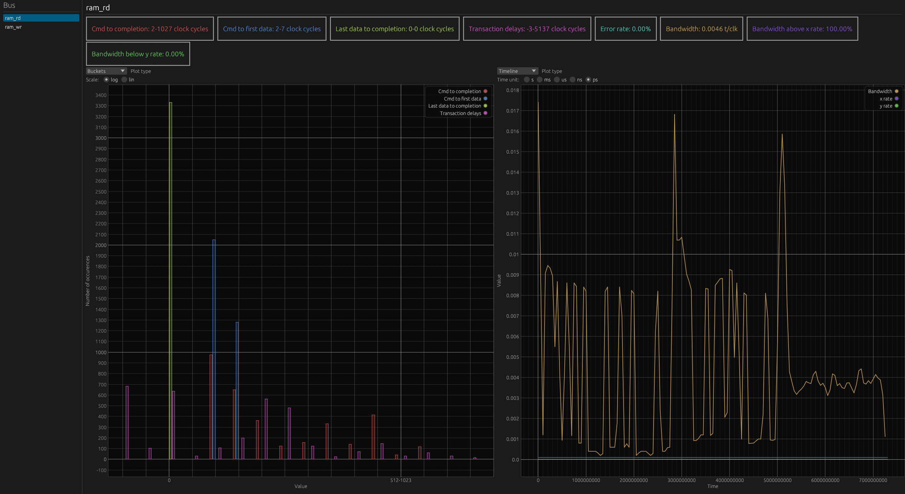

# Busperf

Copyright (c) 2025 [Antmicro](https://www.antmicro.com)

Busperf helps analyze bus performance and identify throughput bottlenecks based on simulation traces.
It ingests VCD/FST files with an accompanying bus description in YAML, then generates both visual and textual statistics on bus activity.
This helps users quickly identify buses with low utilization or high backpressure.
Additionally, the tool supports Python plugins for analyzing custom bus protocols.

## Usage

### Docs

User documentation is available at TODO add link when publicly available. Developer's rustdoc can be generated with:
```sh
$ cargo doc --no-deps --open
```

### Install and run

```sh
$ cargo install --path .
$ busperf --help
```

Shell completion can be generated as described [here](https://github.com/pacak/bpaf?tab=readme-ov-file#dynamic-shell-completion).

### Run without install

Release mode:
```sh
$ cargo run -r -- --help
```
Debug mode:
```sh
$ cargo run -- --help
```

### Build Busperf viewer for WASM

Busperf's data viewer can be compiled to WASM. This allows viewing data files generated by Busperf in a browser.

Build and serve with trunk:
```sh
$ cd busperf_web
$ trunk serve --release
```

Only build:
```sh
$ cd busperf_web
$ trunk build --release
```
The output of the build will be available in the busperf_web/dist directory.
It can be served with any http server.

### Usage help

```
Usage: busperf COMMAND ...

Available options:
    -h, --help  Prints help information

Available commands:
    analyze     Analyze given trace
    show        Show statistics from a file
```

**busperf analyze**
```
Usage: busperf analyze (--gui | --csv | --md | --text) [-o=OUT] [--skip=SKIPPED_STATS]
[-s=FILENAME] [-m=BURST] [-w=WINDOW] [-x=X_RATE] [-y=Y_RATE] [-v] [-p=PATH] TRACE BUS_CONFIG

Available positional items:
    TRACE                     vcd/fst file with simulation trace
    BUS_CONFIG                yaml with description of buses

Available options:
        --gui                 Run GUI
        --csv                 Format output as csv
        --md                  Format output as md table
        --text                Format output as table
        --save                Save data in busperf format (requires setting -o)
        --html                Generate HTML with embedded busperf_web (requires setting -o)
    -o, --output=OUT          Output filename
        --skip=SKIPPED_STATS  Stats to skip separated by a comma.
    -m, --max_burst_delay=BURST  Max delay during a burst [default: 0]
    -w, --window=WINDOW       Set size of the rolling window [default: 10000]
    -x, --x_rate=X_RATE       Set x_rate for bandwidth above x_rate [default: 0.0001]
    -y, --y_rate=Y_RATE       Set y_rate for bandwidth below y_rate [default: 0.00001]
    -v, --verbose
    -p, --plugins_path=PATH   Path to python plugins [default: "./plugins/python]"
    -h, --help                Prints help information
```

**busperf show**
```
Usage: busperf show (--gui | --csv | --md | --text) [-v] FILENAME

Available positional items:
    FILENAME       File to load statistics from

Available options:
        --gui      Run GUI
        --csv      Format output as csv
        --md       Format output as md table
        --text     Format output as table
    -v, --verbose
    -h, --help     Prints help information
```

### GUI



In the panel on the left, there is a selectable list of the analyzer buses.
In the main panel on top, there is an overview of the statistics of the selected bus.
Below, there are two plot areas, for each you can select what type of statistics you want to view in it.

#### Shortcuts

- up arrow: move bus selection up
- down arrow: move bus selection down
- Plots:
  - double left click: reset plot view
  - right click: open in surfer

### Examples

- Print statistics about the bus described in `test.yaml` with traces from `test.vcd`
<!-- name="example-test" -->
```sh
cargo run -- analyze tests/test_dumps/test.vcd tests/test_dumps/test.yaml --text
```

- Generate an html with embedded data and viewer app
<!-- name="example-html" -->
```sh
cargo run -- analyze tests/test_dumps/test.vcd tests/test_dumps/test.yaml --html -o index.html
```

- Print all statistics and set max burst delay to 1
<!-- name="example-test-verbose" -->
```sh
cargo run -- analyze tests/test_dumps/test.vcd tests/test_dumps/test.yaml --verbose -m 1 --text
```

- Write statistics to `stat.csv` formatted as CSV
<!-- name="example-csv" -->
```sh
cargo run -- analyze tests/test_dumps/test.vcd tests/test_dumps/test.yaml -o stat.csv --csv
```

- Print statistics to stdout in the md format
<!-- name="example-md" -->
```sh
cargo run -- analyze tests/test_dumps/test.vcd tests/test_dumps/test.yaml --md
```

- Write pretty printed statistics to `out`
<!-- name="example-pretty" -->
```sh
cargo run -- analyze tests/test_dumps/test.vcd tests/test_dumps/test.yaml -o out --text
```

- Clean files generated from examples
<!-- name="example-clean" -->
```sh
rm out stat.csv index.html
```
