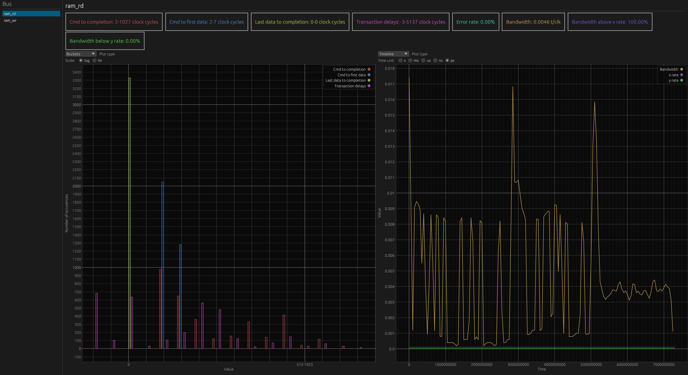

# Busperf

Copyright (c) 2025-2026 [Antmicro](https://www.antmicro.com)

<picture>
    <source media="(prefers-color-scheme: dark)"  srcset="docs/img/logo-readme-dark.png">
    <source media="(prefers-color-scheme: light)" srcset="docs/img/logo-readme-light.png">
    
</picture>

Busperf helps analyze bus performance and identify throughput bottlenecks based on simulation traces.
It ingests VCD/FST files with an accompanying bus description in YAML, then generates both visual and textual statistics on bus activity.
This helps users quickly identify buses with low utilization or high backpressure.
Additionally, the tool supports Python plugins for analyzing custom bus protocols.

## Usage

### Install and run

```sh
$ cargo install busperf
$ busperf --help
```

Shell completion can be generated as described [here](https://github.com/pacak/bpaf?tab=readme-ov-file#dynamic-shell-completion).

### GUI



In the panel on the left, there is a selectable list of the analyzer buses.
In the main panel on top, there is an overview of the statistics of the selected bus.
Below, there are two plot areas, for each you can select what type of statistics you want to view in it.

#### Shortcuts

- up arrow: move bus selection up
- down arrow: move bus selection down
- Plots:
  - double left click: reset plot view
  - right click: open in surfer

### Documentation

User docs can be found at [antmicro.github.io/busperf/](https://antmicro.github.io/busperf/).

Developer docs can be generated with:
```sh
$ cargo doc --workspace --no-deps --open --document-private-items
```

### Examples

- Print statistics about the bus described in `test.yaml` with traces from `test.vcd`
<!-- name="example-test" -->
```sh
cargo run -- analyze tests/test_dumps/test.vcd tests/test_dumps/test.yaml --text
```

- Print all statistics and set max burst delay to 1
<!-- name="example-test-verbose" -->
```sh
cargo run -- analyze tests/test_dumps/test.vcd tests/test_dumps/test.yaml --verbose -m 1 --text
```

- Write statistics to `stat.csv` formatted as CSV
<!-- name="example-csv" -->
```sh
cargo run -- analyze tests/test_dumps/test.vcd tests/test_dumps/test.yaml -o stat.csv --csv
```

- Print statistics to stdout in the md format
<!-- name="example-md" -->
```sh
cargo run -- analyze tests/test_dumps/test.vcd tests/test_dumps/test.yaml --md
```

- Write pretty printed statistics to `out`
<!-- name="example-pretty" -->
```sh
cargo run -- analyze tests/test_dumps/test.vcd tests/test_dumps/test.yaml -o out --text
```

- Clean files generated from examples
<!-- name="example-clean" -->
```sh
rm out stat.csv
```

### Build Busperf viewer for WASM

Busperf's data viewer can be compiled to WASM. This allows viewing data files generated by Busperf in a browser.

Build and serve with trunk:
```sh
$ cd busperf_web
$ trunk serve --release
```

Only build:
```sh
$ cd busperf_web
$ trunk build --release
```
The output of the build will be available in the busperf_web/dist directory.
It can be served with any http server.

