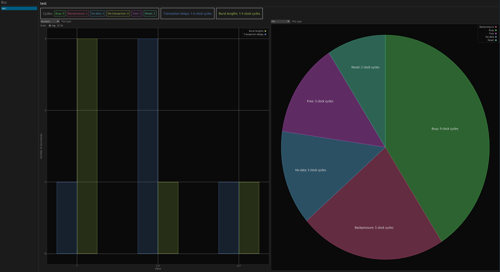

# Output

For each described bus, Busperf will calculate and display several statistics.

## Single channel

- `bus_name`: name of the bus
- `busy`: number of clock cycles performing transaction
- `free`: bus is not used
- `no transaction`: transaction is not performed
- `backpressure`: [backpressure](https://en.wikipedia.org/wiki/Back_pressure)
- `no data`: receiver ready but no data is available to transfer
- `delays between transaction`: delays in clock cycles between transactions
- `burst lengths`: lengths of bursts including delays during burst

Table matching state of the bus with Busperf statistic name:

| busperf        | busy                  | free               | no transaction     | backpressure      | no data         | unknown        |
|----------------|-----------------------|--------------------|--------------------|-------------------|-----------------|----------------|
| axi            | ready && valid        | !ready && !valid   | not used           | !ready && valid   | ready && !valid | no used        |
| ahb            | seq / no seq          | idle               | not used           | hready            | trans=BUSY      | other          |
| credit valid   | credit>0 && valid     | credit>0 && !valid | credit=0 && !valid | not used          | not used        | other          |
| apb            | setup or access phase | !psel              | not used           | access && !pready | not used        | other          |

## Multi channel

- `Cmd to completion`: number of clock cycles from issuing a command to receiving a response
- `Cmd to first data`: number of clock cycles from issuing a command to first data being transferred
- `Last data to completion`: number of clock cycles from last data being transferred to transaction end
- `Transaction delays`: delays between transactions in clock cycles
- `Error rate`: percentage of transactions that resulted in error
- `Bandwidth`: averaged bandwidth in transactions per clock cycle

## Examples

### Single channel buses

| bus name | Busy | Backpressure | No data | No transaction | Free | Reset | Transaction delays   | Burst lengths        |
|----------|------|--------------|---------|----------------|------|-------|----------------------|----------------------|
| test     | 9    | 5            | 3       | 0              | 3    | 2     | 1 x1; 2-3 x3; 4-7 x1 | 1 x3; 2-3 x1; 4-7 x1 |

| bus name | Busy | Backpressure | No data | No transaction | Free | Reset | Transaction delays | Burst lengths              |
|----------|------|--------------|---------|----------------|------|-------|--------------------|----------------------------|
| a_       | 0    | 0            | 15      | 0              | 0    | 15    | 16-31 x1           | No transaction on this bus |
| b_       | 0    | 0            | 15      | 0              | 0    | 15    | 16-31 x1           | No transaction on this bus |

### Multi channel buses

