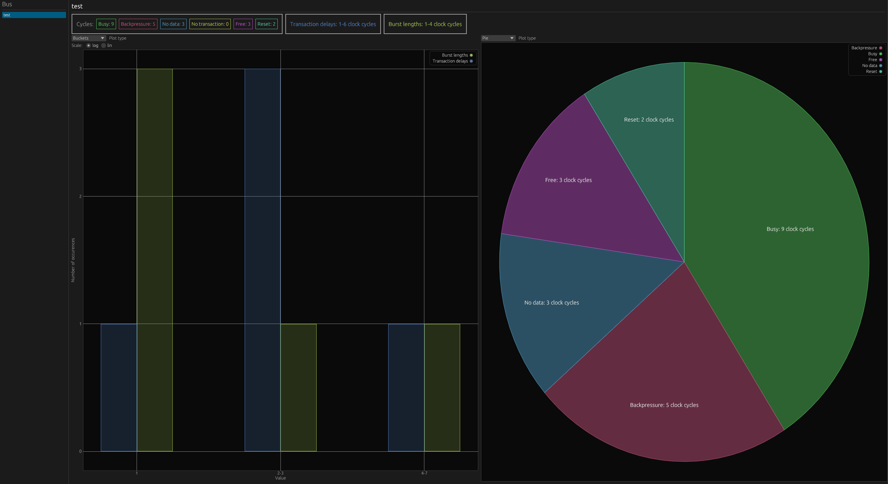

# Quick start

Busperf requires 2 things to analyze performance of the bus:

- **Bus description**: a YAML file which describes the bus(es) we want to analyze
- **Simulation trace**: FST/VCD trace of the simulation

## Prepare bus description

Most important part of the bus description is the `interfaces` block.
Here we define what are the buses that should be analyzed.

```yaml
interfaces:
  "a_":
    scope: [$rootio, some_module, a]
    clock: "clk_i"
    reset: "rst_ni"
    reset_type: "low"

    handshake: "ReadyValid"
    ready: "a_ready"
    valid: "a_valid"

  "b_":
    scope: [$rootio, b]
    clock: "clk_i"
    reset: "rst"
    reset_type: "high"

    handshake: "APB"
    psel: "b_psel"
    penable: "b_penable"
    pready: "b_pready"
```

In this example we define 2 buses to be analyzed `a_` and `b_`.
For each bus those 4 elements are always required:
- `scope` - scope path to the signals
- `clock` - name of the clock signal
- `reset` - name of the reset signal
- `reset_type` - reset active polarity "high" or "low"

Later, we define the bus handshake and names of its signals.
List of signals required by each supported handshake can be viewed in [Analyzers](analyzers.md) chapter.

For full overview of the syntax see [YAML bus description](yaml.md) chapter.

## Run busperf

Busperf can be run with:

```
$ busperf analyze --gui TRACE BUS
```

Replace `TRACE` with a path to the simulation trace and `BUS` to bus description.

## View the statistics



The `--gui` option, which we provided in the last step, presents the statistics in a graphical window.
To use formats `--csv`, `--md`, `--text` or `--save` can be passed instead.
You can read a detailed description of statistics in [Output](output.md) chapter.
